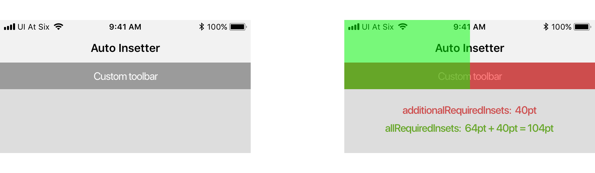

<p align="center">
    
</p>

<p align="center">
    <a href="https://travis-ci.org/uias/AutoInsetter">
        
    </a>
    
    <a href="https://cocoapods.org/pods/AutoInsetter">
        
    </a>
	<a href="https://cocoapods.org/pods/AutoInsetter">
        
    </a>
	<a href="https://github.com/Carthage/Carthage">
        
    </a>
	<a href="https://codecov.io/gh/uias/AutoInsetter">
        
    </a>
	<a href="https://github.com/uias/AutoInsetter/releases">
        
    </a>
</p>

## ⭐️ Features
- [x] Easy to implement custom view controller subview insetting.
- [x] Enhanced support for latest iOS 11 API's - including safe areas.

## 📋 Requirements
AutoInsetter requires iOS 9 and Swift 4.

## 📲 Installation
### CocoaPods
AutoInsetter is available through [CocoaPods](http://cocoapods.org). To install it, simply add the following line to your Podfile:

```ruby
pod 'AutoInsetter', '~> 1.0'
```

And run `pod install`.

### Carthage
AutoInsetter is also available through [Carthage](https://github.com/Carthage/Carthage). Simply install carthage with [Homebrew](http://brew.sh/) using the following command:

```bash
$ brew update
$ brew install carthage
```

Add AutoInsetter to your `Cartfile`:

```ogdl
github "uias/AutoInsetter" ~> 1.0
```

## 🚀 Usage

### 1) Provide a Spec

An `AutoInsetSpec` provides the values that are required to inset the subviews, consisting of:
```swift
var additionalRequiredInsets: UIEdgeInsets
var allRequiredInsets: UIEdgeInsets
```

**But what do the values mean?**
- **`additionalRequiredInsets`** - The custom insets that you require content to be insetted by.
    - E.g. A custom toolbar view underneath a `UINavigationBar` that is `40pt` tall.
        - Return `UIEdgeInsets(top: 40.0, left: 0.0, bottom: 0.0, right: 0.0)`
- **`allRequiredInsets`** - The total inset required for your custom additional insets and for system components.
    - Continuing the previous example, you would just add the `.top` value of the `view.safeAreaInsets` or `topLayoutGuide.length`.
        - This would give a `UIEdgeInsets.top` value of `104.0` on an 4.7" iPhone.

**Pretty pictures explain it all better:**

<p align="center">
    
</p>

*It's probably worth noting that these values probably won't be correct until everything has laid out, so `viewDidLayoutSubviews` is your friend...*

Once you've figured this out, create an object that conforms to `AutoInsetSpec` and provide the required variables.

### 2) Do some insetting

So at this point we have a spec with the values we want to inset by. How do we do some insetting?

Initalize an `AutoInsetter` instance:
```swift
class CustomToolbarViewController: UIViewController {}
    let autoInsetter = AutoInsetter()
}
```

***Recommendation**: The `autoInsetter` wants to live at the same level as the views that require the additional insets (so in this case the custom toolbar).*

When everything has laid out and we will have the correct specification:

```swift
func viewDidLayoutSubviews() {

    let spec = InsetSpec(additionalRequiredInsets: UIEdgeInsets(top: toolbar.height, 
                                                                left: 0.0, bottom: 0.0, right: 0.0),
                         allRequiredInsets: UIEdgeInsets(top: view.safeAreaInsets + toolbar.height, 
                                                         left: 0.0, bottom: 0.0, right: 0.0))

    autoInsetter.inset(self, requiredInsetSpec: spec)
}
```

### 3) Why is this needed?
AutoInsetter is especially useful for content that is embedded in scroll views, such as a `UITableView`. While it is true that the `additionalSafeAreaInsets` property in iOS 11 does something very similar, `AutoInsetter` supports the same functionality in a backwards compatible manner. 

It was primarily created for use in **[Tabman](https://github.com/uias/Tabman)** where it handles insetting of all child view controllers below the visible tab bar.

## ⚠️ Troubleshooting
If you are encountering issues with AutoInsetter, please feel free to raise an [issue](https://github.com/uias/AutoInsetter/issues/new).

## 👨🏻‍💻 About
- Created by [Merrick Sapsford](https://github.com/msaps) ([@MerrickSapsford](https://twitter.com/MerrickSapsford))
- Contributed to by a growing [list of others](https://github.com/uias/AutoInsetter/graphs/contributors).

## ❤️ Contributing
Bug reports and pull requests are welcome on GitHub at [https://github.com/uias/AutoInsetter](https://github.com/uias/AutoInsetter).

## 👮🏻‍♂️ License
The library is available as open source under the terms of the [MIT License](http://opensource.org/licenses/MIT).
